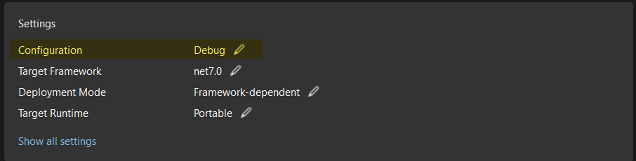

# Performance of debug vs release compilations

I guess every developer has, at least once in their professional life, made the mistake. You deploy software to the production environemnt and you realize you compiled it in _debug_ mode.  
Is it so bad as it sounds?  

_The Dreaded Debug Compilation_

First, let us try and understand the differences between the _debug_ and _release_ modes.  
<a href="https://stackoverflow.com/questions/367884/what-is-the-difference-between-debug-and-release-in-visual-studio/" target="_blank">Stack Overflow</a> has a good answer for this. **Debug** mode adds debug information to the compiled package (it adds the the PDB files) and makes fewer optimizations.

{: .important }
> For this particular test, our attention was directed towards the P2v3 tier, which demonstrates a highly favorable performance-to-cost ratio, making it an excellent choice for most use cases. To understand better our testing protocol, check [this page](dot-net-APIs.md)

# Results
## Windows
