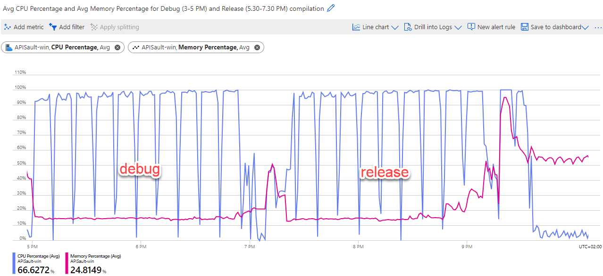
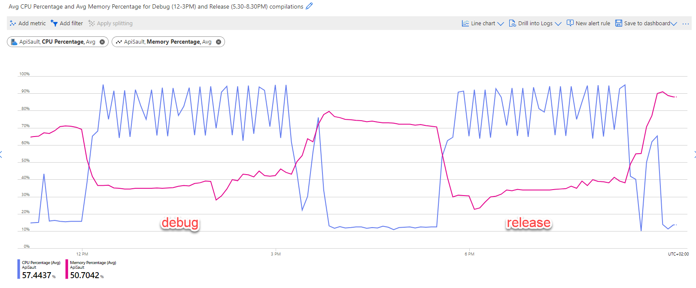

# Performance of debug vs release compilations

Ah, the classic blunder that every developer has experienced at least once in their professional journey. You excitedly deploy your software to the production environment, only to realize with horror that you've compiled it in debug mode. Oopsie daisy!  
But hey, is it really as catastrophic as it sounds? Let's delve into the peculiar world of debug vs release compilations and see what mischief awaits us.

_The Dreaded Debug Compilation_

First, let us try to understand the differences between the _debug_ and _release_ modes. A comprehensive answer to this question can be found on <a href="https://stackoverflow.com/questions/367884/what-is-the-difference-between-debug-and-release-in-visual-studio/" target="_blank">Stack Overflow</a>. In debug mode, debug information is added to the compiled package, including the PDB files, and fewer optimizations are performed.

## Windows

{: .important }
> Don't send the resignation letter just yet: performance-wise, there is litte difference with Azure Functions (especially the Wndows flavor). Other factors will make it hardly relevant.

## Windows

The maximum number of requests per second remains the same between the debug and release modes.
<table>
   <th colspan="4">Maximum requests per second</th>
   <tr><td>Tier</td><td>Good Performance</td><td>Mediocre Performance</td><td>Any performance</td></tr>
   <tr><td>&nbsp;</td><td>95th perc. &lt; 100ms</td><td>95th perc. < 1000ms</td><td>(any 95th perc)</td></tr>
   <tr><td>Windows P2v3 <em>debug mode</em></td><td>825</td><td>1025</td><td>1050</td></tr>
   <tr><td>Windows P2v3 <em>release mode </em></td><td>825</td><td>1025</td><td>1050</td></tr>
</table>

Additionally, both CPU and memory utilization show no significant differences.  

## Linux

Same applies to Linux functions. Comparable reqs/second...
<table>
   <th colspan="4">Maximum requests per second</th>
   <tr><td>Tier</td><td>Good Performance</td><td>Mediocre Performance</td><td>Any performance</td></tr>
   <tr><td>&nbsp;</td><td>95th perc. &lt; 100ms</td><td>95th perc. < 1000ms</td><td>(any 95th perc)</td></tr>
   <tr><td>Linux P2v3 <em>debug mode</em></td><td>700</td><td>850</td><td>950</td></tr>
   <tr><td>Linux P2v3 <em>release mode </em></td><td>775</td><td>875</td><td>950</td></tr>
</table>

..and

