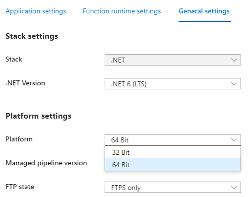
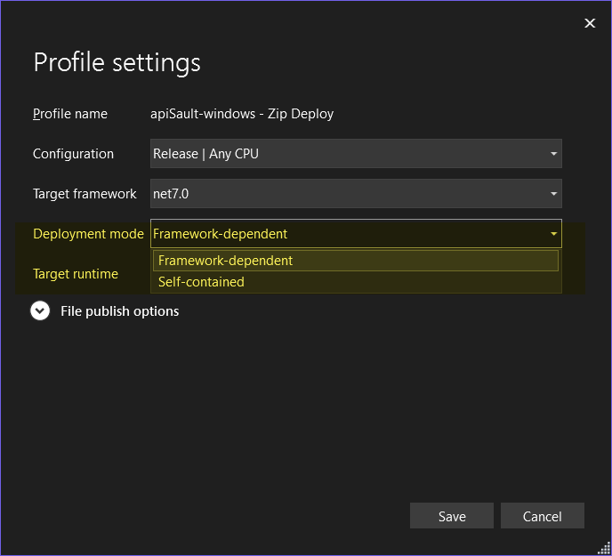
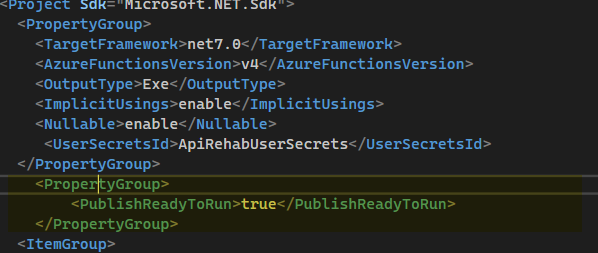

# Performance of Azure Functions with .NET workloads: the case of 64 bits vs 32 bits, ahead-of-time compilation, and self-contained vs framework-dependant binaries

Building upon the findings regarding the comparison between Linux and Windows Azure Functions, we extended our testing to address these common inquiries:

- Does performance improve if I utilize the x86 (32-bit) or x64 (64-bit) frameworks?
- Is deployment dependent on a specific framework better self-contained?
  
- Is Azure's ahead-of-time-flavor compilation, referred to as "ready to run" ([here](https://github.com/Azure/azure-functions-host/issues/5876) is a description), a favorable choice? 
  
_This is where you choose 64bits vs 32bits in the portal, blade "Configuration"._

_These are the deployment options if you deploy from Visual Studio_

_The ready-to-run option_

In conducting these tests, we employed the identical methodology utilized in the main tests (refer to the [azure-functions.md](./azure-functions.md) document) and summarized it as follows:
- Deploying straightforward APIs responsible for retrieving random data from a Redis Cache.
- Assessing performance using a VM equipped with vegeta within the same virtual network as the rest of the infrastructure.

{: .important }
> For this particular test, our attention was directed towards the P2v3 tier, which demonstrates a highly favorable performance-to-cost ratio, making it an excellent choice for most use cases.

# Results
## Windows

The following observations can be gleaned from the tables provided:

- The implementation of the ahead-of-time compilation option (known as "ready to run") does not enhance performance. However, it should be noted that these findings do not consider boot time, which was not measured but is assumed to be better.

- The performance of the 32-bit (x86) and 64-bit (x64) frameworks is highly comparable,

- The choice between self-contained and framework-dependent deployment options appears to have no significant impact on performance.

<table>
   <th colspan="4">Maximum requests per second</th>
   <tr><td>Tier</td><td>Good Performance</td><td>Mediocre Performance</td><td>Any Performance</td></tr>
   <tr><td>&nbsp;</td><td>95th perc. < 100ms</td><td>95th perc. < 1000ms</td><td>(any 95th perc)</td></tr>
   <tr><td>Windows P2v3 <em>Ready to Run</em></td><td>800  </td><td>875</td><td>950</td></tr>
   <tr><td>Windows P2v3 <em>64 bits framework-dependant</em></td><td>825</td><td>1000</td><td>1000</td></tr>
   <tr><td>Windows P2v3 <em>64 bits self-contained</em></td><td>800</td><td>1050</td><td>1050</td></tr>
      <tr><td>Windows P2v3 <em>32 bits framework-dependant</em></td><td>800</td><td>1050</td><td>1050</td></tr>
   <tr><td>Windows P2v3 <em>32 bits self-contained</em></td><td>800</td><td>975</td><td>975</td></tr>
</table>



<noscript>Please enable JavaScript to view the <a href="https://disqus.com/?ref_noscript">comments powered by Disqus.</a></noscript>
